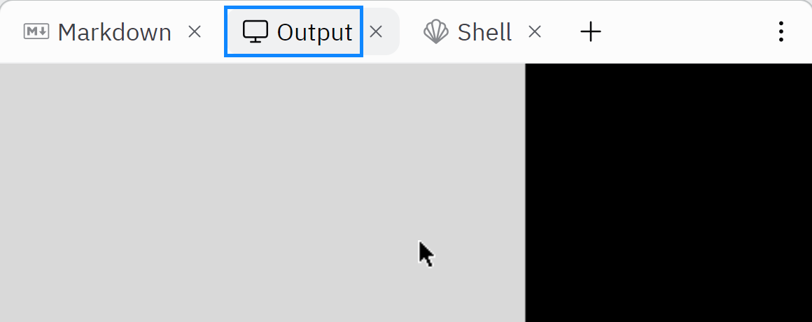

# Tkinter Project - Elyasin Sadri

### Just doing sth with replit and python
---
Tkinter in [replit](https://replit.com) will show an output, If you do not see such a thing go to "Tools" tab and click "Output" then you should have such a tab in replit tab:

---
## What is "Tkinter Project" ?

This is just a random project (my first project in [replit](https://replit.com)) and it will be upgraded by time so you can see updates and commits on [my github](https://github.com/ElyasinSadri1/Tkinter-Project) or in [Markdown File](main.md).

---
© Elyasin Sadri, 2020 - 2023